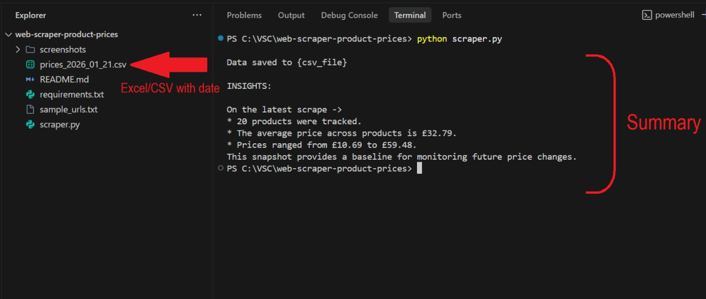

# Product Price Scraper (CSV Deliverable)

A lightweight Python script that scrapes product names and prices from an e-commerce listing page and exports the data as a **clean, timestamped CSV**.

This project is designed as a **micro-product** for competitor price tracking and market research, commonly requested by small businesses and online sellers.

---

## What This Script Does

- Scrapes **product name** and **price** from a public product listing page
- Saves results into a **date-stamped CSV file**
- Generates a **quick summary** (average, minimum, and maximum price)
- Can be easily adapted to **other e-commerce websites** by changing CSS selectors

This is the same structure used in real client projects where prices need to be tracked on a recurring basis.

---

## Example Use Cases

- Competitor price tracking
- Market research and benchmarking
- Weekly pricing reports
- Input data for further analysis or dashboards

---

## Demo Website Used

For this public demonstration, the scraper targets:

http://books.toscrape.com/


This is a publicly available demo e-commerce website commonly used for scraping practice.

> Client projects are always customized to the target website.

---

## Output Example

Each run generates a CSV file with the following structure:

| product_name | price |
|-------------|-------|
| A Light in the Attic | 51.77 |
| Tipping the Velvet | 53.74 |
| Soumission | 50.10 |

File naming format:

prices_YYYY_MM_DD.csv


A sample output file is included in this repository.

---

## Screenshots

### Script Execution

This screenshot shows the scraper running successfully and generating the output file and summary.



### Generated Output Preview

This screenshot demonstrates the final deliverable structure produced by the script.


---

## How to Run

1. Clone this repository
2. Install dependencies
3. Run the script

```bash
pip install -r requirements.txt
python scraper.py


